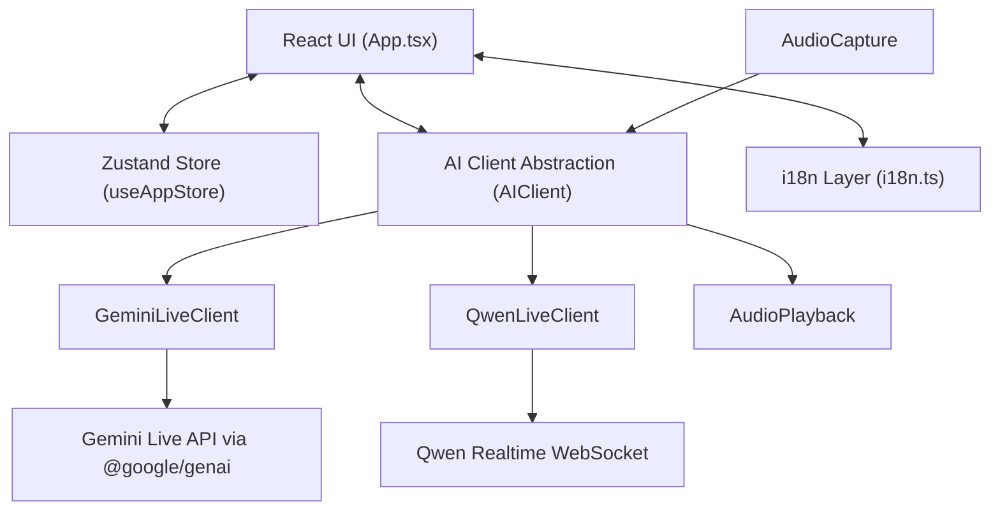

# Architecture And Modules

## 1. Overview

AI Phone Assistant is a browser-based realtime voice supervisor application built with `React + Vite + TypeScript`.

The project no longer uses the earlier Kivy desktop architecture or CLI audio bridge as the primary implementation. The current codebase is centered on:

- a React single-page app
- local browser audio capture and playback
- a Zustand app store
- model-specific realtime client adapters

The app is backendless at the application layer. Audio capture, transcript preview, prompt control, and playback all happen in the frontend runtime.

## 2. High-Level Architecture

## 3. Main Modules

### 3.1 UI Layer

Primary file: `src/App.tsx`

Responsibilities:

- render the supervisor console
- manage connect / disconnect flow
- manage collapsible settings and prompt area
- display voice input / output state
- show transcript and system events
- submit whisper commands
- export conversation logs

Current UI characteristics:

- responsive layout for desktop and narrow viewports
- adaptive light / dark theme using CSS variables and system color preference
- localized UI labels and status text

### 3.2 Global State

Primary file: `src/store/useAppStore.ts`

Responsibilities:

- selected model: `Gemini | Qwen`
- target language
- UI language
- editable call purpose / system instruction
- persisted API keys
- connection status
- transcript message history

Persistence behavior:

- API keys are stored in browser local storage
- `callPurpose` is stored in browser local storage
- `uiLanguage` is stored in browser local storage

### 3.3 Internationalization

Primary file: `src/i18n.ts`

Responsibilities:

- define supported UI locales
- resolve `auto` UI language from browser language
- provide localized labels for settings, voice cards, status, transcript placeholders, and controls

Current supported UI locales:

- English
- Chinese
- Japanese
- Korean
- French
- Spanish
- Auto / follow-system

Current target output language options:

- Auto
- English
- Chinese
- Japanese
- Korean
- French
- Spanish

### 3.4 Audio Input

Primary file: `src/audio/AudioCapture.ts`

Responsibilities:

- request microphone permission through `getUserMedia`
- create a browser audio pipeline
- resample / prepare model input around 16 kHz PCM16 expectations
- emit mic level and speech activity signals for UI monitoring
- emit PCM chunks to the active AI client

This module is also responsible for providing enough audio activity information for the input monitoring card in the UI.

### 3.5 Audio Output

Primary file: `src/audio/AudioPlayback.ts`

Responsibilities:

- receive streamed PCM16 chunks from the active AI client
- convert PCM16 to `Float32Array` for Web Audio playback
- schedule chunk playback continuously to reduce clicks and gaps
- recreate the playback context when sample rate changes
- resume suspended browser audio contexts when required

Important current behavior:

- playback sample rate is not hard-coded to a single output rate
- Gemini and Qwen output can be handled through the same playback abstraction

### 3.6 AI Client Abstraction

Primary file: `src/api/AIClient.ts`

Responsibilities:

- define a shared interface for realtime model providers
- normalize lifecycle methods:
  - `connect`
  - `disconnect`
  - `sendAudio`
  - `sendWhisper`
- expose callback hooks for:
  - streamed audio output
  - transcript preview
  - finalized transcript
  - connection state

This abstraction keeps the UI independent from provider-specific transport details.

### 3.7 Gemini Adapter

Primary file: `src/api/GeminiLiveClient.ts`

Current implementation:

- uses the official `@google/genai` SDK
- opens a live session through `GoogleGenAI().live.connect(...)`
- sends mic audio through `session.sendRealtimeInput(...)`
- sends supervisor whispers through `session.sendClientContent(...)`

Current Gemini configuration:

- model: `models/gemini-2.5-flash-native-audio-preview-12-2025`
- response modality: audio
- media resolution: medium
- voice: `Zephyr`
- input audio transcription: enabled
- output audio transcription: enabled
- context window compression: enabled

Current prompt composition:

- base assistant behavior
- call purpose
- target output language constraint

### 3.8 Qwen Adapter

Primary file: `src/api/QwenLiveClient.ts`

Current implementation:

- uses a browser WebSocket connection to DashScope realtime API
- sends session initialization with `session.update`
- streams audio via `input_audio_buffer.append`
- sends whisper instructions via `conversation.item.create`
- handles transcript completion and audio delta events

### 3.9 Styling

Primary file: `src/index.css`

Responsibilities:

- define theme tokens with CSS variables
- support system light / dark preference
- style the responsive shell, panels, inputs, cards, and footer controls

## 4. Current Design Principles

- Frontend-first: keep the interaction loop inside the browser where possible
- Provider abstraction: isolate Gemini and Qwen protocol differences
- Realtime usability first: the supervisor must see input, output, and transcript signals quickly
- Prompt steerability: whisper commands should be fast and silent
- Progressive localization: UI text should not be locked to English
- Responsive supervision: the app must remain usable on narrower screens

## 5. Out Of Date Historical Assumptions

The following descriptions are no longer accurate for the current primary implementation:

- Kivy as the main UI framework
- Python audio I/O as the active runtime path
- Node CLI bridge as the default architecture
- raw Gemini browser WebSocket protocol as the main Gemini implementation
- deep-dark-only UI as the only visual mode

Those concepts may still appear in older design history, but they should not be treated as the current product baseline.
