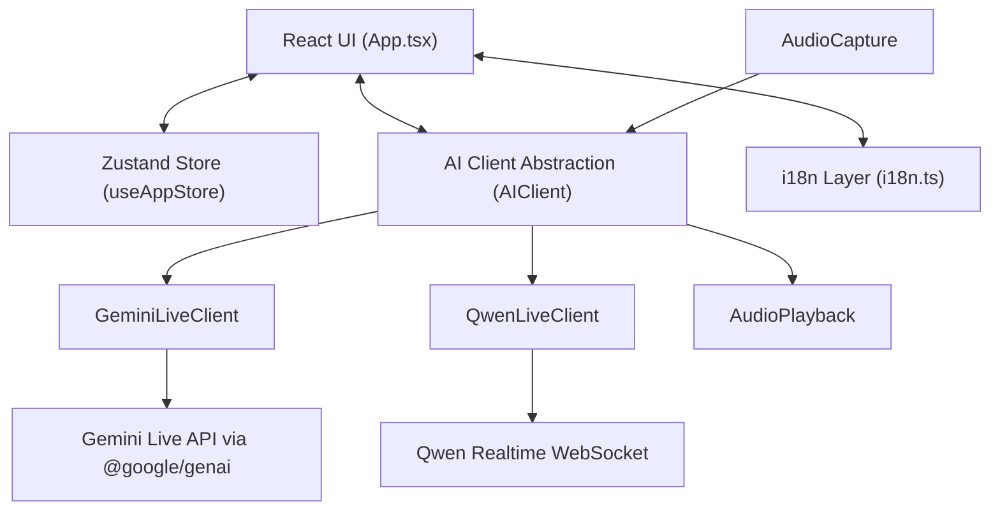

# 架构与模块说明

## 1. 概览

AI Phone Assistant 是一个基于浏览器的实时语音监督应用，技术栈为 `React + Vite + TypeScript`。

项目不再以早期的 Kivy 桌面方案或 CLI 音频桥接为主实现路径。当前代码基线集中在：

- React 单页应用
- 浏览器侧音频采集与播放
- Zustand 全局状态
- 针对不同模型厂商的实时 client 适配器

应用在产品层面是 backendless 的：音频采集、转写预览、提示词控制与播放都在前端运行时完成。

## 2. 高层架构

## 3. 主要模块

### 3.1 UI 层

核心文件：`src/App.tsx`

职责：

- 渲染监督控制台
- 管理连接/断开流程
- 管理可折叠的设置与 prompt 区域
- 显示精简的输入/输出电平监控状态
- 显示转写与系统事件
- 发送静默指令
- 导出会话日志

当前 UI 特性：

- 桌面与窄窗口响应式布局
- 通过 CSS 变量适配系统浅色/深色主题
- UI 文案本地化
- 明确区分“界面语言”与“AI 说话语言”
- 底部粘附的静默指令栏，支持快速干预
- Gemini 会话上下文诊断信息可折叠显示

### 3.2 全局状态

核心文件：`src/store/useAppStore.ts`

职责：

- 选择的模型：`Gemini | Qwen`
- AI 输出语言（AI spoken language）
- 界面语言（interface language）
- Gemini voice 预设
- 可编辑 call purpose / system instruction
- API keys 持久化
- 连接状态
- 转写消息历史

持久化行为：

- API keys 存于浏览器 local storage
- `callPurpose` 存于浏览器 local storage
- `uiLanguage` 存于浏览器 local storage
- `geminiVoice` 存于浏览器 local storage

### 3.3 国际化

核心文件：`src/i18n.ts`

职责：

- 定义支持的 UI 语言
- 将 `auto` 解析为浏览器语言
- 提供设置项、监控卡、状态、占位文本与控件的本地化文案

当前支持的 UI 语言：

- English
- Chinese
- Japanese
- Korean
- French
- Spanish
- Auto / follow-system

当前支持的 AI 输出语言选项：

- Auto
- English
- Chinese
- Japanese
- Korean
- French
- Spanish

应用会刻意区分：

- 监督 UI 的界面语言
- 会话中 AI 的输出语言约束

### 3.4 音频输入

核心文件：`src/audio/AudioCapture.ts`

职责：

- 通过 `getUserMedia` 申请麦克风权限
- 创建浏览器音频处理链路
- 将输入准备为 16 kHz PCM16
- 输出麦克风电平与语音活动信号用于 UI
- 输出 PCM 分片给当前 AI client

该模块负责为输入监控卡提供足够的“是否有音频活动”的信号。

当前 UI 中，识别文本不会在精简的 voice 卡中重复显示；识别文本统一在转写时间线中追踪。

### 3.5 音频输出

核心文件：`src/audio/AudioPlayback.ts`

职责：

- 接收来自 AI client 的 PCM16 音频分片
- 将 PCM16 转为 Web Audio 所需的 `Float32Array`
- 对分片做连续调度播放，减少爆音与间隙
- 采样率变化时重建播放 context
- 在需要时 `resume` 浏览器 audio context

关键行为：

- 播放采样率不是固定写死
- Gemini 与 Qwen 的输出均可复用同一播放抽象

### 3.6 AI Client 抽象

核心文件：`src/api/AIClient.ts`

职责：

- 定义统一的实时 provider 接口
- 统一生命周期方法：
  - `connect`
  - `disconnect`
  - `sendAudio`
  - `sendWhisper`
- 暴露回调：
  - 流式音频输出
  - 转写预览
  - 最终转写
  - 连接状态

该抽象让 UI 不需要知道各厂商协议细节。

### 3.7 Gemini 适配器

核心文件：`src/api/GeminiLiveClient.ts`

当前实现：

- 使用官方 `@google/genai` SDK
- 通过 `GoogleGenAI().live.connect(...)` 建立 live session
- 使用 `session.sendRealtimeInput(...)` 上行麦克风音频
- 使用 `session.sendClientContent(...)` 发送静默指令

当前 Gemini 配置：

- model：`models/gemini-2.5-flash-native-audio-preview-12-2025`
- response modality：audio
- media resolution：medium
- voice：可从 UI 选择，默认 `Zephyr`
- input audio transcription：开启
- output audio transcription：开启
- context window compression：开启

prompt 组装：

- 基础电话助手行为
- call purpose
- 输出语言约束

### 3.8 Qwen 适配器

核心文件：`src/api/QwenLiveClient.ts`

当前实现：

- 浏览器 WebSocket 直连 DashScope realtime API
- 连接后发送 `session.update`
- 通过 `input_audio_buffer.append` 上行音频
- 通过 `conversation.item.create` 注入静默指令
- 处理转写完成与音频 delta 事件

### 3.9 样式

核心文件：`src/index.css`

职责：

- 定义主题 token（CSS variables）
- 支持系统浅色/深色偏好
- 负责整体布局、面板、输入、卡片与底部控件的样式
- 支持底部粘附式静默指令栏的表现

## 4. 当前设计原则

- 前端优先：尽可能在浏览器内闭环交互
- 厂商隔离：用适配器隔离 Gemini/Qwen 协议差异
- 实时可用性优先：监督者需要快速看到输入、输出与转写
- 强可控：静默指令必须快速且“不会被读出来”
- 逐步本地化：UI 不应锁死英文
- 响应式监督：在窄窗口也要可用

## 5. 已过期的历史假设

以下描述不再适用于当前主实现：

- Kivy 作为主 UI 框架
- Python 音频 I/O 作为当前运行路径
- Node CLI bridge 作为默认架构
- Gemini 原始浏览器 WebSocket 协议作为主实现
- 只有深色模式的 UI

这些内容可能仍会出现在历史资料中，但不应当作当前产品基线。

