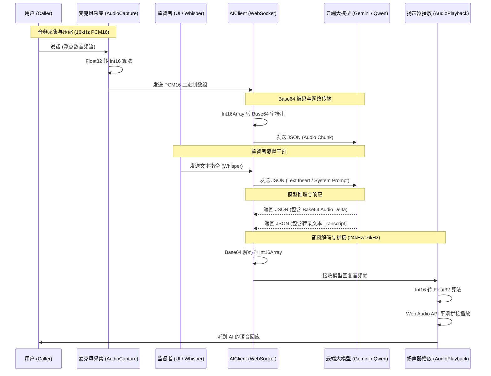
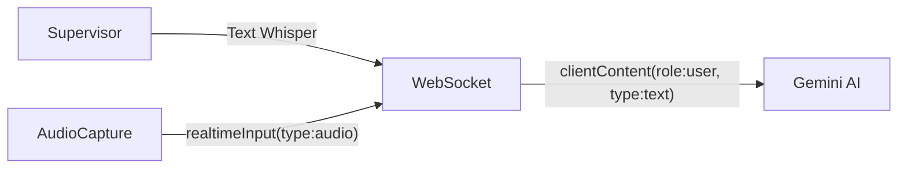
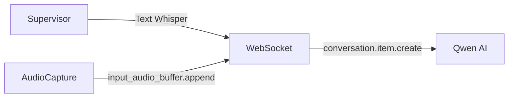

# 音频与 WebSocket 通信流程图及算法

## 1. 核心流程概述

AI Phone Assistant 的核心是围绕 **实时语音流** 与 **大语言模型（Gemini/Qwen）** 的双向互动建立的。在这个架构中，浏览器扮演了“物理世界（麦克风/扬声器）”与“云端 AI”的直接中继器。所有复杂的音频重采样、编解码以及流式传输都在前端本地处理。

### 1.1 全双工 (Full-Duplex) 实时交互流程


## 2. 核心算法解析

由于 Web Audio API 原生处理的是 `[-1.0, 1.0]` 范围的 32位浮点数 (`Float32Array`)，而大模型 API 强制要求 `[-32768, 32767]` 范围的 16位有符号整数 (`Int16Array`)（PCM16 小端序格式），因此需要进行实时的数据转换。

### 2.1 麦克风采集 -> 模型输入 (Float32 to Int16)
在 `src/audio/AudioCapture.ts` 中的 `ScriptProcessorNode` 或 `AudioWorklet` 回调函数中：
```javascript
// inputData 是一帧采集到的 Float32 数组 (例如 2048 个采样点)
const inputData = e.inputBuffer.getChannelData(0);

// 创建等长的 Int16 数组用于存放转换后的数据
const pcm16 = new Int16Array(inputData.length);

for (let i = 0; i < inputData.length; i++) {
  // 1. 削峰防爆音处理 (Clipping)
  const s = Math.max(-1, Math.min(1, inputData[i]));

  // 2. 映射到 16-bit 整数范围
  // 负数乘以 0x8000 (32768)
  // 正数乘以 0x7FFF (32767)
  pcm16[i] = s < 0 ? s * 0x8000 : s * 0x7FFF;
}
```

### 2.2 模型输出 -> 扬声器播放 (Int16 to Float32)
在 `src/audio/AudioPlayback.ts` 中接收模型下发的音频后：
```javascript
// pcm16Data 是从 WebSocket 接收并 Base64 解码后的 Int16 数组
const float32Data = new Float32Array(pcm16Data.length);

for (let i = 0; i < pcm16Data.length; i++) {
  // 逆向映射回 [-1.0, 1.0]
  float32Data[i] = pcm16Data[i] / (pcm16Data[i] < 0 ? 0x8000 : 0x7FFF);
}

// 调度 Web Audio API 播放
const audioBuffer = audioContext.createBuffer(1, float32Data.length, sampleRate);
audioBuffer.getChannelData(0).set(float32Data);
```

### 2.3 无缝拼接调度算法 (Seamless Playback Scheduling)
由于音频是切片（Chunk / Delta）流式返回的，直接播放会产生严重的咔哒声（Clicking / Popping）。系统维护一个 `nextStartTime` 游标来实现平滑拼接。
```javascript
const currentTime = audioContext.currentTime;

// 如果系统当前时间已经超过了游标（说明播放队列已空或者发生卡顿），
// 强制将游标拨回到当前时间，避免音频重叠或严重滞后。
if (nextStartTime < currentTime) {
  nextStartTime = currentTime;
}

// 在游标时间精确启动这一帧音频
source.start(nextStartTime);

// 将游标向后推移这一帧音频的持续时间 (duration = length / sampleRate)
nextStartTime += audioBuffer.duration;
```

## 3. WebSocket 数据流向与干预机制 (Whisper Intervention)

系统如何处理“一边通语音电话，一边能接收人类主管通过打字发来的干预指令”？不同大模型有不同的适配策略：

### 3.1 Gemini Bidi API (`src/api/GeminiLiveClient.ts`)

- **音频流发送**：封装在 `realtimeInput` 事件的 `mediaChunks` 中，指定 `mimeType` 为 `audio/pcm;rate=16000`。
- **文本干预 (Whisper)**：Gemini 允许在语音通话的同时并发出 `clientContent` 消息（角色为 `user`，内容为 `text`）。系统 Prompt 预先告知 AI 收到文字消息代表“Supervisor 指令”，必须立刻响应并转移话题，且禁止大声读出指令内容。

### 3.2 Qwen Realtime API (`src/api/QwenLiveClient.ts`)

- **音频流发送**：采用兼容 OpenAI 规范的 `input_audio_buffer.append` 格式直接上传 Base64 字符串。
- **文本干预 (Whisper)**：由于在纯语音会话中直接插入文本存在模型兼容性，系统通过 `conversation.item.create` 构造一条带特殊格式前缀的虚拟用户消息：
  `[LATEST SUPERVISOR WHISPER: {text} - STEER THE CONVERSATION NOW WITHOUT READING THIS OUT LOUD]`
  这能在不打断整体 WebSocket 长连接的前提下，成功劫持模型上下文，诱导 AI 对话转向。
