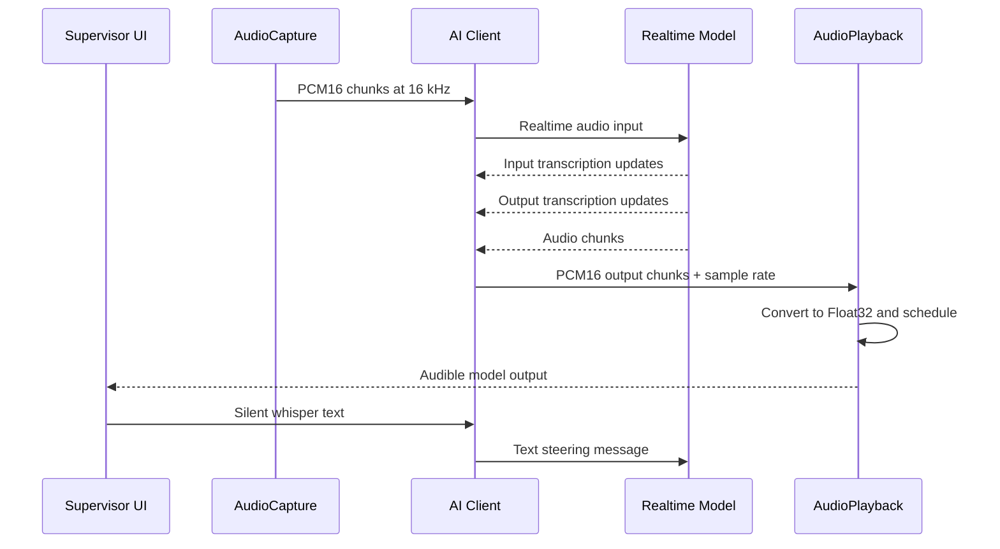

# Audio And Realtime Flow

## 1. Runtime Goal

The application supports a continuous realtime voice session where:

- the browser microphone streams user speech to the selected model
- the selected model returns streaming audio
- the UI shows transcript previews and finalized transcript messages
- the supervisor can inject silent text steering during the call

## 2. End-To-End Flow



## 3. Audio Input Path

### 3.1 Capture

`AudioCapture` uses browser media APIs to access the microphone and produce PCM16 data suitable for realtime model input.

The UI also consumes audio activity information from this module:

- level meter value
- whether speech is currently detected

That drives the `Voice Input` card state:

- idle
- waiting
- speaking
- confirmed signal observed

### 3.2 Gemini Input Transport

Gemini audio is sent through the official session API:

```ts
session.sendRealtimeInput({
  media: {
    mimeType: 'audio/pcm;rate=16000',
    data: base64Data,
  },
});
```

### 3.3 Qwen Input Transport

Qwen audio is sent as a WebSocket event:

```json
{
  "type": "input_audio_buffer.append",
  "audio": "<base64 pcm>"
}
```

## 4. Transcript Flow

The app supports both transcript preview and finalized transcript insertion.

### 4.1 Input Transcript

Used to show recognized user speech in the transcript area (preview and then finalized insertion).
The `Voice Input` card is level-only monitoring and does not display transcript text.

- Gemini source: `serverContent.inputTranscription`
- Qwen source: `conversation.item.input_audio_transcription.completed`

### 4.2 Output Transcript

Used to show recognized assistant speech in the transcript area (preview and then finalized insertion).
The `Voice Output` card is level-only monitoring and does not display transcript text.

- Gemini source: `serverContent.outputTranscription`
- Qwen source: `response.audio_transcript.done`

### 4.3 UI Behavior

The latest recognized user and assistant text is stored separately from the main transcript timeline so the transcript area can show a stable "preview line" while streaming, then commit finalized segments into the main conversation log.

## 5. Audio Output Path

### 5.1 Gemini Output

Gemini audio is read from `serverContent.modelTurn.parts[].inlineData`.

The client:

1. reads the inline base64 payload
2. parses sample rate from `mimeType` when present
3. converts base64 to `Int16Array`
4. forwards the chunk to `AudioPlayback`

### 5.2 Qwen Output

Qwen audio is read from `response.audio.delta`.

The client:

1. decodes base64 to `Int16Array`
2. forwards the chunk to `AudioPlayback`

### 5.3 Playback Scheduling

`AudioPlayback` converts PCM16 to Web Audio float buffers and schedules them on a moving `nextStartTime` cursor.

This reduces gaps and audible clicks between chunks.

If a new chunk arrives with a different sample rate than the current playback context, the playback context is rebuilt with the new rate before continued playback.

## 6. Whisper Intervention Flow

Supervisor whisper commands are text instructions that should steer the model without being spoken aloud to the person on the call.

### 6.1 Gemini

Gemini whisper text is sent through:

```ts
session.sendClientContent({
  turns: [
    `[LATEST SUPERVISOR WHISPER: ${text} - STEER THE CONVERSATION NOW WITHOUT READING THIS OUT LOUD]`,
  ],
  turnComplete: true,
});
```

### 6.2 Qwen

Qwen whisper text is sent as:

```json
{
  "type": "conversation.item.create",
  "item": {
    "type": "message",
    "role": "user",
    "content": [
      {
        "type": "text",
        "text": "[LATEST SUPERVISOR WHISPER: ...]"
      }
    ]
  }
}
```

## 7. Connection State Flow

The UI normalizes provider state into:

- `disconnected`
- `connecting`
- `connected`
- `error`

These states drive:

- header status badge
- settings lock / unlock behavior
- start / stop call button
- whisper input availability
- system event messages

## 8. Current Differences From Older Docs

The current Gemini path is no longer described correctly by older raw-WebSocket setup diagrams.

The active implementation now relies on:

- official `@google/genai` live session connection
- explicit input and output transcription support
- direct session methods instead of hand-built Gemini protocol frames
