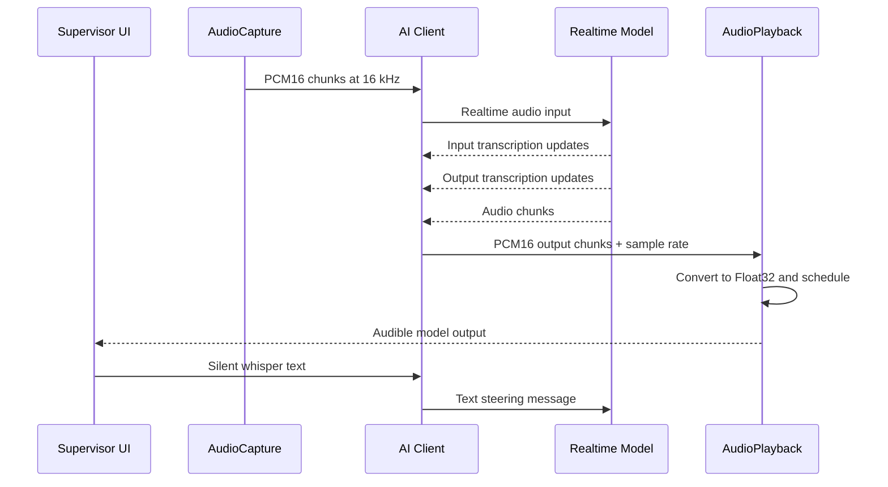

# 音频与实时链路流程

## 1. 运行目标

应用支持一条连续的实时语音会话：

- 浏览器麦克风将用户语音流式发送到选中的模型
- 模型返回流式音频
- UI 显示转写预览与最终转写消息
- 监督者可在通话中注入“静默文本引导”

## 2. 端到端流程



## 3. 音频输入路径

### 3.1 采集

`AudioCapture` 使用浏览器媒体 API 访问麦克风，并产出适用于实时模型输入的 PCM16 数据。

UI 也会消费该模块产出的音频活动信息：

- 电平值（level meter）
- 是否检测到语音（speech detected）

这些信息会驱动 `Voice Input` 卡片状态：

- idle
- waiting
- speaking
- confirmed signal observed

### 3.2 Gemini 输入传输

Gemini 音频通过官方 session API 发送：

```ts
session.sendRealtimeInput({
  media: {
    mimeType: 'audio/pcm;rate=16000',
    data: base64Data,
  },
});
```

### 3.3 Qwen 输入传输

Qwen 音频以 WebSocket 事件发送：

```json
{
  "type": "input_audio_buffer.append",
  "audio": "<base64 pcm>"
}
```

## 4. 转写流程

应用同时支持“转写预览”和“最终转写落地”。

### 4.1 输入转写

用于在对话区显示识别到的用户语音（先预览，再在最终确认后写入对话时间线）。
`Voice Input` 卡片仅用于电平监控，不再承载转写文字展示。

- Gemini 来源：`serverContent.inputTranscription`
- Qwen 来源：`conversation.item.input_audio_transcription.completed`

### 4.2 输出转写

用于在对话区显示识别到的 AI 语音（先预览，再在最终确认后写入对话时间线）。
`Voice Output` 卡片仅用于电平监控，不再承载转写文字展示。

- Gemini 来源：`serverContent.outputTranscription`
- Qwen 来源：`response.audio_transcript.done`

### 4.3 UI 行为

应用会把最新的用户/助手识别文本与主对话时间线分开维护：流式过程中对话区显示稳定的“预览行”，随后再把最终分段提交进主对话记录，避免出现“词语闪现、难以追踪”的体验。

## 5. 音频输出路径

### 5.1 Gemini 输出

Gemini 音频从 `serverContent.modelTurn.parts[].inlineData` 读取。

client 会：

1. 读取 inline base64 payload
2. 如存在则从 `mimeType` 解析 sample rate
3. base64 转为 `Int16Array`
4. 将分片转交给 `AudioPlayback`

### 5.2 Qwen 输出

Qwen 音频从 `response.audio.delta` 读取。

client 会：

1. base64 解码为 `Int16Array`
2. 将分片转交给 `AudioPlayback`

### 5.3 播放调度

`AudioPlayback` 将 PCM16 转为 Web Audio float buffer，并通过滚动的 `nextStartTime` 游标进行分片调度播放。

这能降低分片间的间隙与爆音。

如果新分片携带的采样率与当前播放 context 不一致，播放层会先重建 context，再继续播放。

## 6. 静默指令流程

静默指令是监督者的文本引导，目标是影响模型行为，但不应被模型朗读给通话对端。

### 6.1 Gemini

Gemini 静默指令通过以下方式发送：

```ts
session.sendClientContent({
  turns: [
    `[LATEST SUPERVISOR WHISPER: ${text} - STEER THE CONVERSATION NOW WITHOUT READING THIS OUT LOUD]`,
  ],
  turnComplete: true,
});
```

### 6.2 Qwen

Qwen 静默指令通过以下事件发送：

```json
{
  "type": "conversation.item.create",
  "item": {
    "type": "message",
    "role": "user",
    "content": [
      {
        "type": "text",
        "text": "[LATEST SUPERVISOR WHISPER: ...]"
      }
    ]
  }
}
```

## 7. 连接状态流程

UI 将厂商状态归一化为：

- `disconnected`
- `connecting`
- `connected`
- `error`

这些状态会驱动：

- 顶部状态徽章
- 设置面板是否可编辑
- Start/Stop 按钮
- 静默指令输入是否可用
- 系统事件消息

## 8. 与旧文档的差异

旧的 raw WebSocket Gemini setup 图不再适用于当前实现。

当前 Gemini 实现依赖：

- 官方 `@google/genai` live session 连接
- 明确开启的 input/output 转写
- 直接调用 session 方法，而不是手工拼装低层协议帧
